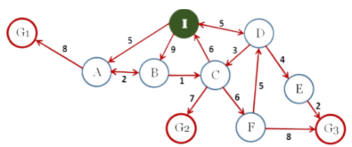

# AI-Graph-Search

## About AI Graph Search

**Short Description:**

A smart graph search based on the fundamental AI algorithms: BFS (Breadth-First Search) and DFS (Depth First Search).
The algorithms perform a blind and smart search on the following graph.
So, Υou can choose to run either the BFS or the DFS algorithm.
The project created and developed using **python**.

**Aim of Project:**

The aim of this project is to find the path from the **Initial State (node ​​I)** to one of the **Final/Target States (nodes G1, G2, G3)**,
by applying the BFS or DFS algorithm.

The implementation of each algorithm returns:
- The target node found.
  
- The path followed from the initial node to the target node.
  
- All nodes in order visited by the algorithm, regardless of whether they belong to the solution path.
## Run Algorithms

Run *BFS* algorithm:

```bash
py BFS.py
```

Run *DFS* algorithm:

```bash
py DFS.py
```

**About BFS:**

1. Knowing the initial state and the desired final states, BFS performs a blind search on the graph to find one of the final states.
2. It chooses to expand the set-front with all states that are at the same depth and then proceeds to higher level states.
3. It has a Queue structure.

**About DFS:**

1. Knowing the initial state and the desired final states, DFS performs a blind search on the graph to find one of the final states.
2. It chooses to expand the set-front with the state located deeper in the search tree.
3. It has a Stack structure.

**Graph:**


